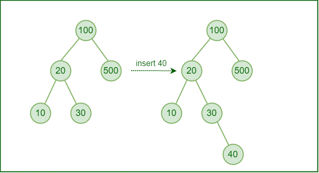

# TDA ABB

## Repositorio de Didier Erik Watson - 96064 - dwatson@fi.uba.ar

- Para compilar:

```bash
make all
```

- Para ejecutar:

```bash
./pruebas_alumno || ./pruebas_chanutron
```

- Para ejecutar con valgrind:
```bash
make valgrind-alumno || make valgrind-chanutron
```
---
## Qué es un arbol?
Un árbol es una estructura no lineal de datos compuesta de nodos. Un árbol que no tiene ningún nodo se llama árbol vacío o nulo. Un árbol que no está vacío consta de un nodo raíz y potencialmente muchos niveles de nodos adicionales que forman una jerarquía. Si un nodo, no posee hijos, se lo denomina, nodo hoja.

<div align="center">

</div>

## ¿Qué es un arbol binario?
Es aquel árbol en donde cada nodo padre puede tener hasta dos hijos solamente.

<div align="center">

</div>

## ¿Qué es un arbol binario de búsqueda? 
Es aquel árbol que además de ser binario (dos nodos hijo máximo por padre), cumple con la convención de que el subárbol izquierdo contiene todos los elementos menores (en esta implementación son menores o iguales) al que contiene el nodo que se observa, y que todo el subárbol derecho, contiene todos los elementos mayores al nodo que se está observando.

<div align="center">

</div>

## Implementación
Se decidió implementar las funciones de una manera pseudo recursiva, en donde se tiene una función que llama a una función recursiva (p.e: `abb_insertar` llama a `_abb_insertar_recursivo`).
Si bien la recursividad puede ser difícil para implementar en un principio, se prefirió antes que utilizar engorrosos métodos con ciclos for/while. Lo importante con la recursividad es entender cual es el/los caso/s base, para poder luego autollamar a la función recursiva.
La mayor dificultad estuvo, en encontrar una manera de remover nodos del árbol que tuvieran dos hijos.

### Detalles de implementacion
* En caso de tener un elemento repetido, se lo inserta a la izquierda.
* En caso de tener que quitar un nodo con dos hijos, se busca como reemplazante al predecesor inorden. Este es el elemento más grande del subárbol izquierdo del nodo que se quiere quitar.

## Esquema de memoria
<div align="center">

</div>

## Operaciones básicas del abb (y su complejidad)
Crear arbol
Esta función pide memoria para una estructura del tipo abb_t. Su complejidad es `O(1)`, ya que solamente crea la estructura y la devuelve.

### Insertar un elemento
Con el comparador, la función decide por cual rama ir (si la comparación devuelve mayor,menor o igual al elemento). Entonces estamos subdividiendo el árbol por cada paso que damos, nos quedamos con la subrama izquierda o la derecha en cada instancia. Estamos diviendo en dos al árbol por cada subrama que elegimos. Por lo tanto la complejidad promedio es 
`O(Log(n))` (particularmente es Logaritmo en base dos de n). Sin embargo, en esta implementación el árbol no se balancea, por lo tanto puede darse el caso que el árbol degenere en una lista, y por lo tanto, la complejidad del peor caso (que es el que nos interesa) es O(n). Se deben recorrer todos los elementos previos para insertar.

<div align="center">

</div>

### Buscar un elemento
Análogo a insertar, el peor de los casos es que tenga que recorrer todos los nodos para encontrar el elemento buscado. Por lo tanto la complejidad algorítmica es O(n).

### Quitar un elemento
Análogo a buscar, el peor de los casos es que tenga que recorrer todos los elementos del árbol para llegar al elemento buscado y quitarlo. Complejidad O(n).
<div align="center">

</div>

<div align="center">

</div>

<div align="center">

</div>

### Recorrer un arbol (Inorden, Preorden, Postorden)
En todos los casos, la complejidad es O(n), ya que debo recorrer todos los elementos del arbol.

<div align="center">

</div>

### Destruir el arbol
Es una operación de complejidad O(n). Debo recorrer todo el árbol para remover todos sus nodos.

